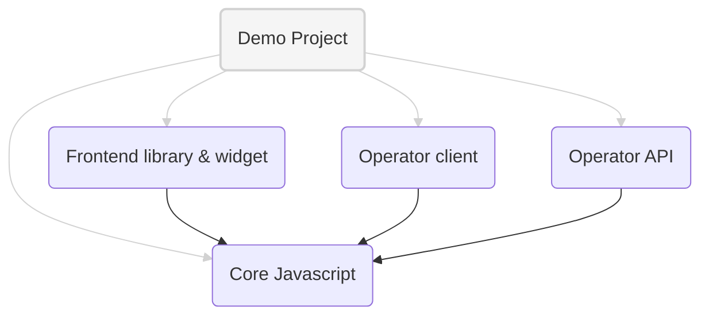

# Prebid Addressability Framework (PAF) implementation

Implementation repository for Prebid Addressability Framework (PAF).

Reference implementation of the Minimum Viable Product (MVP) defined [here](https://github.com/criteo/addressable-network-proposals/tree/main/mvp-spec).

The demo website can be visited here [publisher-demo](https://www.pafdemopublisher.com/)

| Sub-project                                                          | Description                                                                                                                                                                 |
|----------------------------------------------------------------------|-----------------------------------------------------------------------------------------------------------------------------------------------------------------------------|
| [paf-mvp-demo-express](./paf-mvp-demo-express)                       | A set of **demo** publishers and advertisers hosted on NodeJS and using Prebid Addressability Framework                                                                     |
| [paf-mvp-frontend](./paf-mvp-frontend)                               | The official implementation of a **frontend client** for PAF, including Javascript library and reference **UI widgets**                                                     |
| [paf-mvp-operator-client-express](./paf-mvp-operator-client-express) | A NodeJS (Express) implementation of the [operator backend client and proxy](https://github.com/criteo/addressable-network-proposals/blob/main/mvp-spec/operator-client.md) |
| [paf-mvp-operator-express](./paf-mvp-operator-express)               | A NodeJS (Express) implementation of the [operator API](https://github.com/criteo/addressable-network-proposals/blob/main/mvp-spec/operator-api.md)                         |
| [paf-mvp-core-js](./paf-mvp-core-js)                                 | The Javascript fondation (**data model**, endpoint paths...) used by all other projects                                                                                     |
| [paf-mvp-cmp](./paf-mvp-cmp)                                 | A PAF and TCF compatible CMP widget|
| [paf-mvp-audit](./paf-mvp-audit)                                 | The code to generate and show an audit log viewer|

To run a demo project of PAF, visit [paf-mvp-demo-express](./paf-mvp-demo-express)
