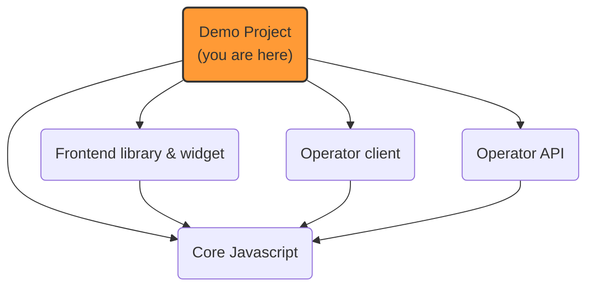

# Prebid Addressability Framework (PAF): demo

A set of fake websites to demonstrate the features of Prebid Addressability Framework.

Can also be used to investigate implementation details.

Served by ExpressJS web server.

## Usage

1. Access the [publisher](https://publisher.com)'s website to be prompted for a new id & your preferences
2. Access the [advertiser](https://advertiser.com)'s website to see ids and preferences **synced** automatically
   1. this website is configured to only get existing ids and preferences, but not to prompt for consent.
3. You can repeat this test with:
    1. a browser known to **not** support 3PC (Safari)
    2. a browser known to support 3PC, but explicitly **disable** it in settings
4. In this context you will notice full page **redirects** to sync data with PAF
5. You can adjust id and preferences in the technical "[portal](https://portal.pafdemo.com)"
6. To start from scratch, delete all `paf_*` cookies both on pafdemo.com and on the websites' domains.

# PAF implemenation projects


## Installation
### Quick start
0. Prepare SSL

Generate certificates
```sh
openssl req -out paf.csr -newkey rsa:2048 -nodes -keyout paf.key -extensions req_ext -config openssl-csr.conf
openssl x509 -req -days 3650 -in paf.csr -signkey paf.key -out paf.crt -extensions req_ext -extfile openssl-csr.conf
```
Add root certificate as a trusted one

Mac OS

```shell
sudo security add-trusted-cert -d -r trustRoot -k "$HOME/Library/Keychains/login.keychain" paf.crt
```

Windows

```shell
CertUtil -addStore Root paf.crt
```
1. Launch the server locally:

```shell
npm install
npm run build
npm run start
```

2. Edit your `/etc/hosts` file or equivalent to fake your web browser to target `localhost`.
    1. See console logs when starting the server for details
    
## Configuration

### Publisher

Depending on the configuration in [config.ts](src/config.ts), the publisher's website has different integration modes
to read Prebid SSO ID:
- http redirect
    - the **operator URL** is built by the publisher's backend (using an "operator API backend client library")
    - the http server replies with a `303` redirect
- `<meta>` html tag
    - same logic, but the redirect is part of the returned HTML page
- **pure Javascript** integration
    - in this configuration, the publisher's website uses an endpoint **hosted on the CMP backend**
    - this endpoint is protected by CORS configuration to only allow the CMP clients
    - the CMP dynamically builds the **operator URL** and redirects to "signed" URLs
    - in this scenario, the publisher **backend** has no specific module related to PAF

### Advertiser

As an illustration, the advertiser's website uses **HTTP** redirects to the operator to read Prebid cookie.
