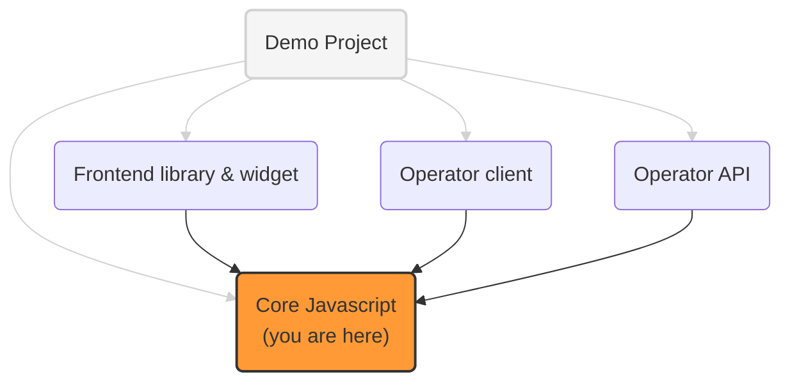

# OneKey core Javascript library

This library provides core files used
by different OneKey Javascript projects.

In particular:
- cookies and messages data model
- cookies and messages builders
- signature & signature verification

## OneKey implementation projects

