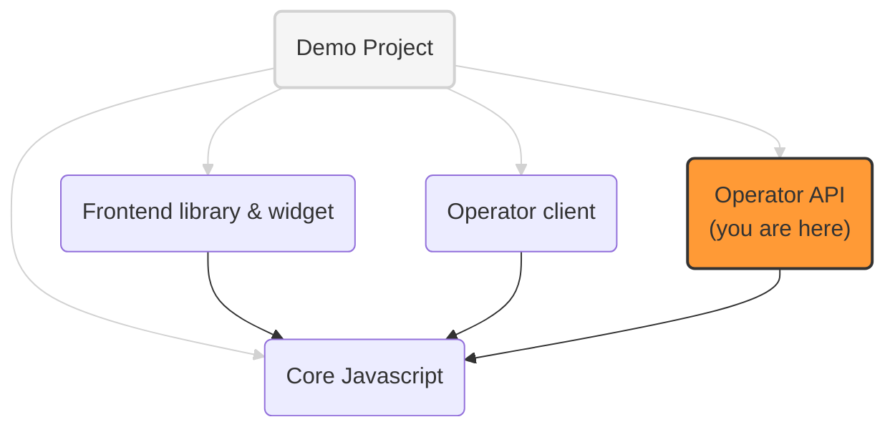

# OneKey Operator: ExpressJS implementation

An implementation of the OneKey operator API, served by ExpressJS web server.

It implements the latest version of the [Operator API](https://github.com/OneKey-Network/addressability-framework/blob/main/mvp-spec/operator-api.md)

## OneKey implementation projects

