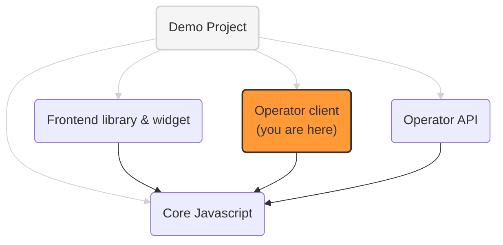

# OneKey client node: ExpressJS implementation

An implementation of the OneKey client, served by ExpressJS web server.

It includes a "client node" which provides endpoints needed by the [frontend library](../paf-mvp-frontend)
  to sign and verify messages sent to and received from the operator. 

See [website-design](../addressable-network-proposals/blob/main/mvp-spec/website-design.md) for details

## OneKey implementation projects

