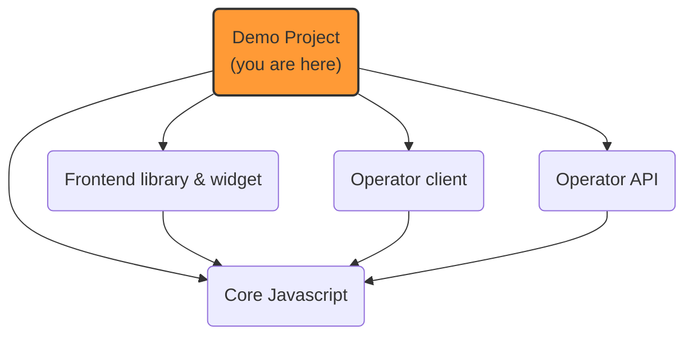

# Prebid Addressability Framework (PAF): demo

A set of fake websites to **demonstrate** the features of Prebid Addressability Framework
and **debug** the code behind it.

## PAF implementation projects


## Play with the demo websites

The demo is currently made of a set of websites accessible to anyone.

- 3 fake publisher websites:
  - [PIF publisher](https://www.pifdemopublisher.com/)
  - [PAF publisher](https://www.pafdemopublisher.com/)
  - [POF publisher](https://www.pofdemopublisher.com/)
- 3 fake advertiser websites:
  - [PIF advertiser](https://www.pifmarket.shop/)
  - [PAF advertiser](https://www.pafmarket.shop/)
  - [POF advertiser](https://www.pofmarket.shop/)

What makes a difference between these two types of websites is related to **first visits** and in particular how **unknown users** are handled:
- publisher websites will ask for consent before anything
- advertiser websites will only query PAF: if the user is recognized, preferences are stored and a notification snackbar is displayed. Otherwise, the user is considered opt out.

A typical demo scenario would be to:
- visit a publisher website first, notice the "first visit" UI and **define your marketing preferences**
- reload the page and notice the widget is not displayed
- visit another website and verify a **notification snackbar** is displayed with the accurate message
- repeat on another website and **click the "marketing preferences" link** on the notification snackbar, and do some changes
- visit another website and verify that the notification snackbar reflects these changes
- repeat this by using the "marketing preferences" link that appears **at the bottom of the page** (change the preferences or id value)
- wait ONE minute (this is the "refresh frequency" on this demo)
- refresh a website that has been visited already: the notification snackbar should be displayed

Of course this scenario can be run **with or without support of 3d party cookies** to demonstrate different sync mechanism (JS calls or full-page redirects)

Finally, a "backoffice" [portal](http://portal.onekey.network/) is available to display the current ids and preferences on OneKey domain and easily reset it.
This component is not meant for end users.

You might also want to delete the `paf_*` cookies from some websites to simulate a first visit to the website.

## Local installation

To install and run the demo project locally, follow these instructions:

0. Clone the repository

1. Prepare SSL

Generate certificates
```sh
openssl req -out paf.csr -newkey rsa:2048 -nodes -keyout paf.key -extensions req_ext -config paf-mvp-demo-express/openssl-csr.conf
openssl x509 -req -days 3650 -in paf.csr -signkey paf.key -out paf.crt -extensions req_ext -extfile paf-mvp-demo-express/openssl-csr.conf
```
Add root certificate as a trusted one

Mac OS

```shell
sudo security add-trusted-cert -d -r trustRoot -k "$HOME/Library/Keychains/login.keychain" paf.crt
```

Windows

```shell
CertUtil -addStore Root paf.crt
```

3. Launch the server locally

```shell
npm install
npm run build-front
npm run start
```

3. Edit your `/etc/hosts` file or equivalent to fake your web browser to target `localhost`.
    1. See console logs when starting the server for details
    2. On Linux / MacOS, use the following script:

```shell
# Target localhost
sudo ts-node -r tsconfig-paths/register scripts/fake-hosts.ts add

# Use DNS
sudo ts-node -r tsconfig-paths/register scripts/fake-hosts.ts remove
```

✓ You should now be able to access the demo websites running locally.

## Contribute to the project

To contribute to the project, visit [CONTRIBUTE.md](CONTRIBUTE.md)
