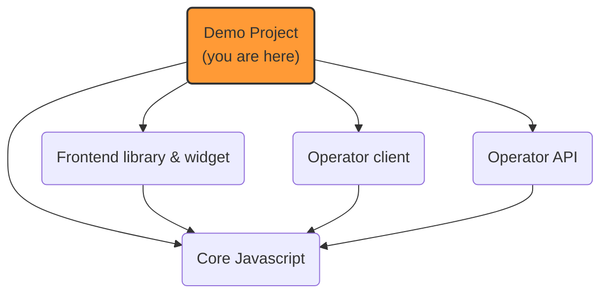

# OneKey: demo

A set of fake websites to **demonstrate** the features of Prebid Addressability Framework
and **debug** the code behind it.

## OneKey implementation projects


## Play with the demo websites

The demo is currently made of a set of websites accessible to anyone.

- 3 fake advertiser websites:
    - [PAF advertiser](https://www.pafmarket.shop/)
    - [POF advertiser](https://www.pofmarket.shop/)
    - [PIF advertiser](https://www.pifmarket.shop/)
- advertiser websites only gather user consent
- 3 fake publisher websites:
    - [PAF publisher](https://www.pafdemopublisher.com/)
    - [POF publisher](https://www.pofdemopublisher.com/)
    - [PIF publisher](https://www.pifdemopublisher.com/)
- publisher websites trigger **ad display** through PrebidJS

A typical demo scenario would be to:
- visit a publisher website first, notice the "first visit" UI and **define your marketing preferences**
- reload the page and notice the widget is not displayed
- visit another website and verify a **notification snackbar** is displayed with the accurate message
- repeat on another website and **click the "marketing preferences" link** on the notification snackbar, and do some changes
- visit another website and verify that the notification snackbar reflects these changes
- repeat this by using the "marketing preferences" link that appears **at the bottom of the page** (change the preferences or id value)
- wait ONE minute (this is the "refresh frequency" on this demo)
- refresh a website that has been visited already: the notification snackbar should be displayed

Note: all sites can be accessed on the "root url"
(ex: [https://www.pafdemopublisher.com/](https://www.pafdemopublisher.com/))
or on any sub-path (ex: [https://www.pafdemopublisher.com/some-page/under-path?with-query-string=something](https://www.pafdemopublisher.com/some-page/under-path?with-query-string=something)).
All pages will look exactly the same, but this can be the opportunity to test the solution under different circumstances.

Of course this scenario can be run **with or without support of 3d party cookies** to demonstrate different sync mechanism (JS calls or full-page redirects)

Finally, a "backoffice" [portal](http://portal.onekey.network/) is available to display the current ids and preferences on OneKey domain and easily reset it.
This component is not meant for end users.

You might also want to delete the `paf_*` cookies from some websites to simulate a first visit to the website.

## Local installation

⚠️ While most demo websites rely on OneKey **clients** hosted by the same web server instance,
PIF publisher and PIF advertiser use OneKey clients hosted by Criteo on another web server instance.
_When running the demo locally_, these clients are started in the same instance, so the demo is "self-sufficient".

To install and run the demo project locally, follow these instructions:

0. Clone the repository

1. Make sure you have **node** installed, on the version defined in [.nvmrc](../.nvmrc)

2. Go to this directory

    ```shell
    cd paf-mvp-demo-express
    ```

3. Prepare SSL

    - Generate certificates

        ```shell
        openssl req -out paf.csr -newkey rsa:2048 -nodes -keyout paf.key -extensions req_ext -config openssl-csr.conf
        openssl x509 -req -days 3650 -in paf.csr -signkey paf.key -out paf.crt -extensions req_ext -extfile openssl-csr.conf -sha256
        ```

    - Add root certificate as a trusted one

        - Mac OS

            ```shell
            sudo security add-trusted-cert -d -r trustRoot -k "$HOME/Library/Keychains/login.keychain" paf.crt
            ```

        - Windows

            ```shell
            CertUtil -addStore Root paf.crt
            ```

        - Linux (Archlinux)

            ```shell
            sudo trust anchor --store paf.crt
            sudo trust extract-compat
            ```

4. Launch the server locally in the root directory of this repository

    ```shell
    cd ..
    npm install
    npm run build-front
    npm run start
    ```

    Note: the server listens on the privileged ports 80 and 443, so make sure to have the appropriate rights.

    On linux, one can give access to the privileged ports to node with the following command: `sudo setcap 'cap_net_bind_service+ep' $(which node)`

5. Edit your "hosts" file to fake your web browser to target `localhost`.
    ```shell
    cd paf-mvp-demo-express

    # Target localhost
    sudo ts-node -r tsconfig-paths/register scripts/fake-hosts.ts add

    # Use DNS
    sudo ts-node -r tsconfig-paths/register scripts/fake-hosts.ts remove
    ```

    ✓ You should now be able to access the demo websites running locally.

## Contribute to the project

To contribute to the project, visit [CONTRIBUTE.md](CONTRIBUTE.md)
