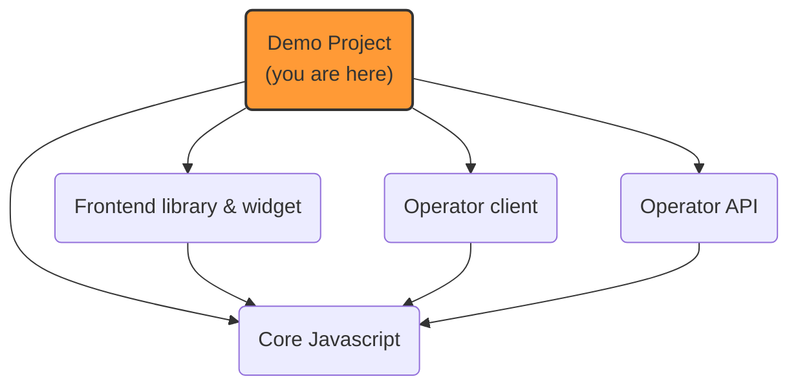

# Prebid Addressability Framework (PAF): demo

A set of fake websites to demonstrate the features of Prebid Addressability Framework.

Can also be used to investigate implementation details.

Served by ExpressJS web server.

## Usage

- The [config.ts](src/config.ts) file contains the server names of publisher, advertiser and portal websites.
Refer to it to know to display these demo websites.

1. Access the publisher's website to be prompted for a new id & your preferences
2. Access the advertiser's website to see ids and preferences **synced** automatically
   1. this website is configured to only get existing ids and preferences, but not to prompt for consent.
3. You can repeat this test with:
    1. a browser known to **not** support 3PC (Safari)
    2. a browser known to support 3PC, but explicitly **disable** it in settings
4. In this context you will notice full page **redirects** to sync data with PAF
   1. on the advertiser's website, the redirect is not triggered on page load:
      1. you will need to **click on any of the menu items** (so that a redirect happens and ids and preferences are refreshed from operator)
5. You can adjust id and preferences in the technical "portal"
6. To start from scratch, delete all `paf_*` cookies both on the PAF top level "+1" domain and on the websites' domains.

# PAF implemenation projects

## Use cases

### Publisher

Depending on the configuration in [config.ts](src/config.ts), the publisher's website has different integration modes
to read Prebid SSO ID:
- http redirect
    - the **operator URL** is built by the publisher's backend (using an "operator API backend client library")
    - the http server replies with a `303` redirect
- `<meta>` html tag
    - same logic, but the redirect is part of the returned HTML page
- **pure Javascript** integration
    - in this configuration, the publisher's website uses an endpoint **hosted on the CMP backend**
    - this endpoint is protected by CORS configuration to only allow the CMP clients
    - the CMP dynamically builds the **operator URL** and redirects to "signed" URLs
    - in this scenario, the publisher **backend** has no specific module related to PAF

### Advertiser

As an illustration, the advertiser's website uses **HTTP** redirects to the operator to read Prebid cookie.
