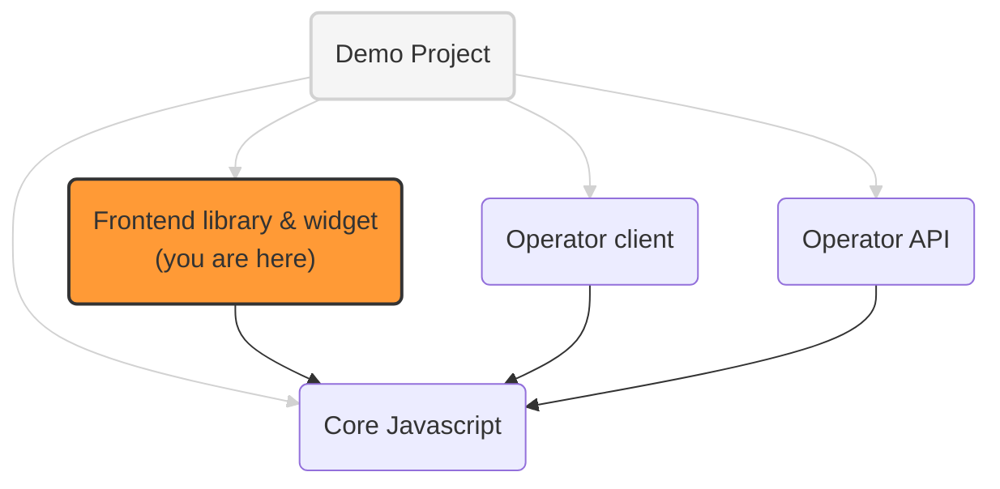

# OneKey frontend library and widget

The frontend components for websites using OneKey:

- a Javascript script to identify users (get user ids and preferences)
- a UI widget to get end user consent for personalized advertising

## OneKey implementation projects



See [addressable-network-proposals](https://github.com/OneKey-Network/addressability-framework/blob/main/mvp-spec/paf-client-node.md)
for more context on the operator **frontend** and **backend** clients and the operator **proxy**

## Identification library integration

To integrate the identification library into a website, website owners should inject the JS script, for example:

```html
<script
  src="https://my-cdn.domain/assets/onekey.js"
  data-client-hostname="cmp.pifdemopublisher.com" <!-- host name of the client node -->
  data-cookie-ttl="PT30S" <!-- cookie TTL -->
></script>
```

Once the script is available, a few methods can be called to manipulate OneKey data,
like `OneKey.getIdsAndPreferences` or `OneKey.generateSeed`.

All details of these public methods in [i-one-key-lib](./src/lib/i-one-key-lib.ts)

Also interesting:
- [paf-mvp-client-express](../paf-mvp-client-express) for technical details
- [paf-mvp-demo](../paf-mvp-demo-express) for examples of integration

## Widget integration

To integrate the widget into a website, website owners should inject the app bundle:

```html

<script 
  src="https://my-cdn.domain/assets/app.bundle.js"
  data-proxy="https://cmp-proxy.url">
</script>
```
To get the user's consent, the widget provides the following API:

`OneKey.promptConsent(): Promise<boolean>` - displays the widget with OneKey information and returns Promise with user's response

`OneKey.showNotification(notificationType: NotificationEnum)` - displays a snack bar with a predefined message
