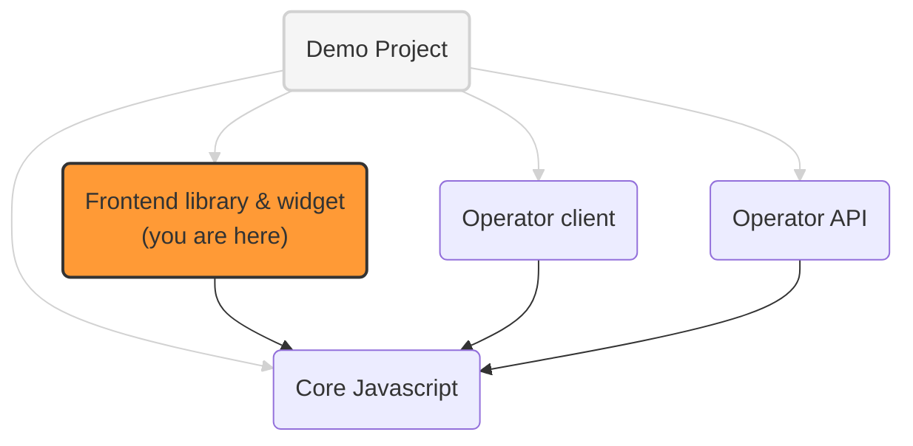

# OneKey frontend library and widget

The frontend components for websites using OneKey:

- a Javascript script to identify users (get user ids and preferences)
- a UI widget to get end user consent for personalized advertising

## OneKey implementation projects



See [addressable-network-proposals](https://github.com/OneKey-Network/addressability-framework/blob/main/mvp-spec/paf-client-node.md)
for more context on the operator **frontend** and **backend** clients and the operator **proxy**

## Identification library integration

To integrate the identification library into a website, website owners should inject the JS script, for example:

```html
<script
  src="https://my-cdn.domain/assets/paf-lib.js"
></script>
```

Once the script is available, a couple of methods can be called to manipulate OneKey data:

- `OneKey.refreshIdsAndPreferences`
  - get existing identifiers and preferences of the current user, from the OneKey operator (via the client node)
  - this is done via XHR calls or HTTP redirect if needed, when 3d party cookies are not supported
  - local cookies `paf_identifiers` and `paf_preferences` are updated to match the values from the operator
  - see [paf-lib.ts](./src/lib/paf-lib.ts) for details
  
Example usage:
```html
<script
  src="https://my-cdn.domain/assets/paf-lib.js"
  onload="OneKey.refreshIdsAndPreferences();"
></script>
```

- `OneKey.signPreferences`
  - takes identifiers and unsigned preferences as input, and **sign it** through a call to the backend proxy.

- `OneKey.writeIdsAndPref`
  - write (persist) new preferences and ids to the OneKey TLD+1 domain

- `OneKey.getNewId`
  - calls the operator (via the client node) to get a new OneKey ID value
  - note that this id is **not** yet persisted: to persist it, a subsequent call to `OneKey.writeIdsAndPref` must be made

All these methods take at least a `proxyHostName` parameter to locate the client node
needed to sign and verify messages sent to and received from the operator.

- `OneKey.getIdsAndPreferences`
  - no parameter
  - simply return the list of identifiers and the user preferences, if they exist as 1PC

See:

- [paf-mvp-client-express](../paf-mvp-client-express) for technical details
- [paf-mvp-demo](../paf-mvp-demo-express) for examples of integration

## Widget integration

To integrate the widget into a website, website owners should inject the app bundle:

```html

<script 
  src="https://my-cdn.domain/assets/app.bundle.js"
  data-proxy="https://cmp-proxy.url">
</script>
```
To get the user's consent, the widget provides the next API:

`OneKey.promptConsent(): Promise<boolean>` - displays the widget with OneKey information and returns Promise with user's response

`OneKey.showNotification(notificationType: NotificationEnum)` - displays a snack bar with a predefined message

## Development

You can run `npm start` to create a bundle and start server. The bundle will be available on
http://localhost:3000/dist/app.bundle.js

You can open http://localhost:3000/ to see how it looks like in the sandbox. To test app in "Real Environment", you can
inject script (as described above) to any website.

There are also available scripts:

* `npm run lint` and `npm run lint:prettier` - to lint a code style.

## Deployment

Once deployed, the bundle will be available by the path: `https://{{domain}}/app.bundle.js`
