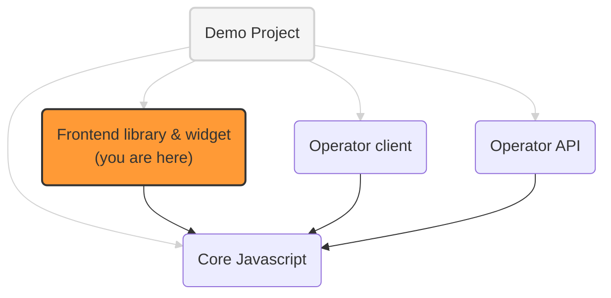

# Prebid Addressability Framework (PAF) frontend library and widget

The frontend components for websites using PAF:
- a Javascript script to identify users (get user ids and preferences)
- a UI widget to get end user consent for personalized advertising

## PAF implementation projects


## Identification library integration

To integrate the identification library into a website, website owners should inject the JS script:
```html
<script src="https://{{library-domain}}/paf-lib.js"></script>
```

Once the script is available, a couple of methods can be called to manipulate PAF data:
- `getIdsAndPreferences`
  - get existing Identifiers and preferences from PAF operator, triggering redirects if needed (if the browser doesn't support 3PC)
- `signPreferences`
  - sign new user preferences
- `writeIdsAndPref`
  - write new preferences and ids on the operator domain

These methods all take one parameter: the root of the client proxy that the website is using.
This (backend) client proxy is needed to sign and verify messages sent to and received from the operator.

Example: `PAF.getIdsAndPreferences('https://advertiser.com')`

See [paf-mvp-operator-client-express](https://github.com/criteo/paf-mvp-operator-client-express) for details
and [paf-mvp-demo](https://github.com/criteo/paf-mvp-demo) for examples.

## Widget integration

To integrate the widget into a website, website owners should inject the app bundle:
```html
<script src="https://{{widget-domain}}/app.bundle.js"></script>
```
and add a tag with widget target attribute:
```html
<div paf-root></div>
```
Website Owners can provide additional information to the widget, such a brand logo, brand name etc.
```html
<!--NOT WORKING IN IE-->
<div paf-root>
  <script type="application/json">
      {
        "brandName": "The Publisher",
        "brandLogoUrl":"http://localhost:3000/images/default-customer-logo.png",
        "color": "green"
      }
  </script>
</div>
```
OR
```html
<!-- WORKS EVERYWHERE -->
<div
  paf-root
  data-prop-brand-name="The Publisher"
  data-prop-brand-logo-url="http://localhost:3000/images/default-customer-logo.png">
</div>
```

## Development

You can run `npm start` to create a bundle and start server. The bundle will be available on
http://localhost:3000/dist/app.bundle.js

You can open http://localhost:3000/ to see how it looks like in the sandbox.
To test app in "Real Environment", you can inject script (as described above) to any website.

There are also available scripts:
* `npm run lint` and `npm run lint:prettier` - to lint a code style.

## Deployment
Once deployed, the bundle will be available by the path: `https://{{domain}}/app.bundle.js`
