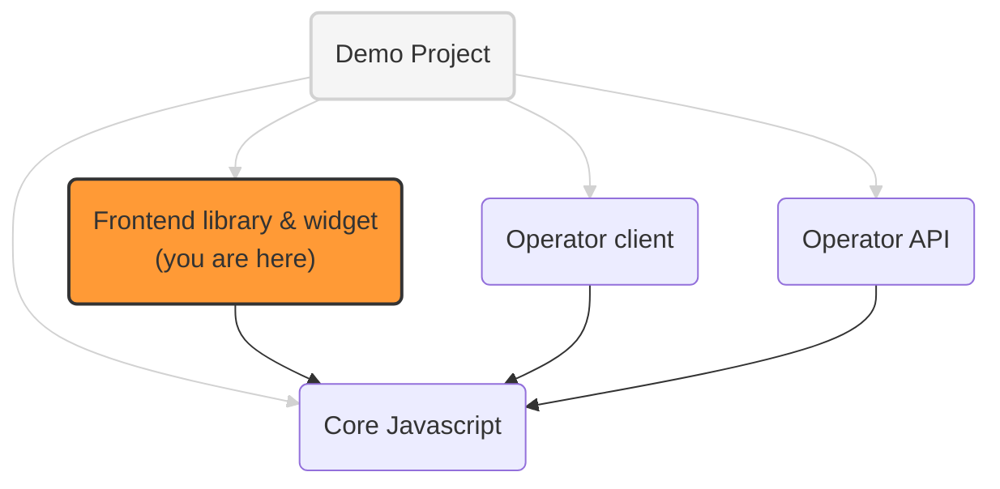

# Prebid Addressability Framework (PAF) frontend library and widget

The frontend components for websites using PAF:

- a Javascript script to identify users (get user ids and preferences)
- a UI widget to get end user consent for personalized advertising

## PAF implementation projects



See [addressable-network-proposals](https://github.com/criteo/addressable-network-proposals/tree/main/mvp-spec/operator-client.md)
for more context on the operator **frontend** and **backend** clients and the operator **proxy**

## Identification library integration

To integrate the identification library into a website, website owners should inject the JS script, for example:

```html
<script
  src="https://my-cdn.domain/assets/paf-lib.js"
></script>
```

Once the script is available, a couple of methods can be called to manipulate PAF data:

- `PAF.refreshIdsAndPreferences`
  - get existing identifiers and preferences of the current user, from the PAF operator (via the PAF proxy)
  - this is done via XHR calls or HTTP redirect if needed, when 3d party cookies are not supported
  - local cookies `paf_identifiers` and `paf_preferences` are updated to match the values from the operator
  - see [paf-lib.ts](./src/lib/paf-lib.ts) for details
  
Example usage:
```html
<script
  src="https://my-cdn.domain/assets/paf-lib.js"
  onload="PAF.refreshIdsAndPreferences({
    proxyHostName: 'my-paf-proxy.domain',
    triggerRedirectIfNeeded: true
  });"
></script>
```

- `PAF.signPreferences`
  - takes identifiers and unsigned preferences as input, and **sign it** through a call to the backend proxy.
  - see [the demo CMP](../paf-mvp-demo-express/src/cmp/js/cmp.ts) for example usage

- `PAF.writeIdsAndPref`
  - write (persist) new preferences and ids to the PAF TLD+1 domain
  - see [the demo CMP](../paf-mvp-demo-express/src/cmp/js/cmp.ts) for example usage

- `PAF.getNewId`
  - calls the operator (via the operator proxy) to get a new PAF ID value
  - note that this id is **not** yet persisted: to persist it, a subsequent call to `PAF.writeIdsAndPref` must be made

All methods take at least a `proxyHostName` parameter to locate the operator backend proxy
needed to sign and verify messages sent to and received from the operator.

See:

- [paf-mvp-operator-client-express](../paf-mvp-operator-client-express) for technical details
- [paf-mvp-demo](../paf-mvp-demo-express) for examples of integration

## Widget integration

To integrate the widget into a website, website owners should inject the app bundle:

```html

<script src="https://my-cdn.domain/assets/app.bundle.js"></script>
```

and add a tag with widget target attribute:

```html

<div paf-root></div>
```

Website Owners can provide additional information to the widget, such a brand logo, brand name etc.

```html
<!--NOT WORKING IN IE-->
<div paf-root>
  <script type="application/json">
      {
        "brandName": "The Publisher",
        "brandLogoUrl":"http://localhost:3000/images/default-customer-logo.png",
        "color": "green"
      }
  
  
  </script>
</div>
```

OR

```html
<!-- WORKS EVERYWHERE -->
<div
  paf-root
  data-prop-brand-name="The Publisher"
  data-prop-brand-logo-url="http://localhost:3000/images/default-customer-logo.png">
</div>
```

## Development

You can run `npm start` to create a bundle and start server. The bundle will be available on
http://localhost:3000/dist/app.bundle.js

You can open http://localhost:3000/ to see how it looks like in the sandbox. To test app in "Real Environment", you can
inject script (as described above) to any website.

There are also available scripts:

* `npm run lint` and `npm run lint:prettier` - to lint a code style.

## Deployment

Once deployed, the bundle will be available by the path: `https://{{domain}}/app.bundle.js`
