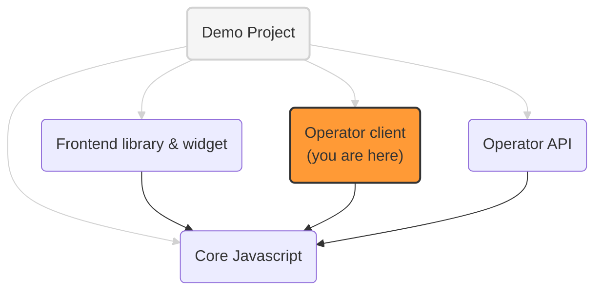

# Prebid Addressability Framework (PAF) Operator client: ExpressJS implementation

An implementation of the PAF operator client, served by ExpressJS web server.

It includes:
- a "backend client": an ExpressJS middleware responsible for triggering HTTP redirects to the operator, when needed, to query ids and preferences cookies.
- a "client proxy": it provides endpoints needed by the [frontend library](../paf-mvp-frontend)
  to sign and verify messages sent to and received from the operator. 

See [website-design](../addressable-network-proposals/blob/main/mvp-spec/website-design.md) for details

## PAF implementation projects

