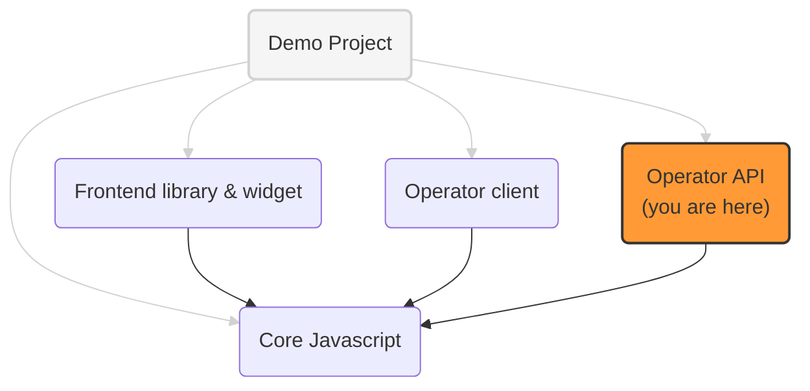

# Prebid Addressability Framework (PAF) Operator: ExpressJS implementation

An implementation of the PAF operator API, served by ExpressJS web server.

It implements the latest version of the [Operator API](https://github.com/prebid/addressability-framework/blob/main/mvp-spec/operator-api.md)

## PAF implementation projects

